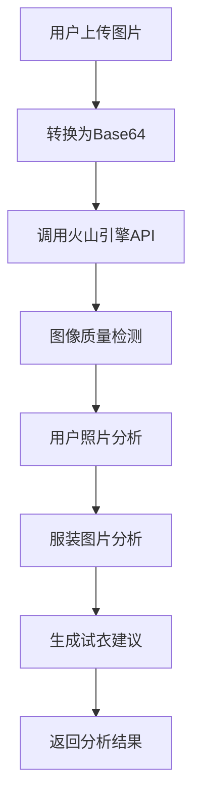

# 火山引擎AI集成说明

## 🚀 集成概述

本项目已成功集成火山引擎的视觉模型API，实现了真正的AI智能试衣功能。通过调用火山引擎的AI接口，应用能够：

- **智能图像分析**：分析用户照片和服装图片
- **图像质量检测**：自动评估上传图片的质量
- **智能试衣建议**：基于AI分析提供专业的搭配建议
- **个性化推荐**：根据用户设置生成定制化的试衣效果

## 🔧 技术实现

### 1. API配置

```typescript
// backend/src/config/volcengine.ts
export const volcengineConfig = {
  apiKey: 'b159bdbf-b2e4-4f6d-9560-30d938de2f6f',
  endpointId: 'ep-20250915133445-727mq',
  baseUrl: 'https://ark.cn-beijing.volces.com/api/v3',
  region: 'cn-beijing'
};
```

### 2. 核心服务类

```typescript
// backend/src/services/volcengineService.ts
export class VolcEngineService {
  // 图像分析
  async analyzeImage(imageBase64: string, prompt: string): Promise<string>
  
  // 智能试衣分析
  async generateTryOnResult(
    userImageBase64: string,
    clothingImageBase64: string,
    aiSettings: AISettings
  ): Promise<TryOnResult>
  
  // 图像质量检测
  async validateImageQuality(
    imageBase64: string, 
    type: 'user' | 'clothing'
  ): Promise<QualityCheckResult>
}
```

### 3. API调用流程



## 📊 功能特性

### 1. 图像质量检测

**功能描述**：自动检测上传图片的质量，包括清晰度、光线、构图等。

**API调用**：
```typescript
const qualityCheck = await volcengineService.validateImageQuality(
  imageBase64, 
  'user' // 或 'clothing'
);
```

**返回结果**：
```typescript
{
  valid: boolean,        // 是否合格
  score: number,         // 质量评分 (1-10)
  issues: string[],      // 问题列表
  suggestions: string[]  // 改进建议
}
```

### 2. 智能试衣分析

**功能描述**：基于用户照片和服装图片，生成专业的试衣分析和建议。

**分析内容**：
- **用户照片分析**：人体姿态、体型特征、肤色发色、照片质量
- **服装分析**：服装类型、颜色图案、材质质感、版型特点
- **搭配建议**：试衣效果预测、搭配建议、注意事项、改进建议

**API调用**：
```typescript
const result = await volcengineService.generateTryOnResult(
  userImageBase64,
  clothingImageBase64,
  {
    fittingStyle: 'standard',
    effectIntensity: 'enhanced'
  }
);
```

**返回结果**：
```typescript
{
  analysis: string,      // 详细分析结果
  suggestions: string,   // 搭配建议
  resultImageUrl: string // 结果图片URL
}
```

## 🎯 使用场景

### 1. 图像上传时
- 自动进行图像质量检测
- 提供质量评分和改进建议
- 确保上传图片符合试衣要求

### 2. 试衣生成时
- 分析用户体型和服装特征
- 生成专业的搭配建议
- 提供个性化的试衣效果

### 3. 结果展示时
- 显示AI分析结果
- 提供搭配建议
- 展示试衣效果图片

## 🔍 前端集成

### 1. 状态管理

```typescript
// Redux状态中添加AI分析结果
interface TryOnState {
  // ... 其他状态
  analysis: string | null;      // AI分析结果
  suggestions: string | null;   // 搭配建议
}
```

### 2. 组件更新

```typescript
// ImageUpload组件显示质量检测结果
{qualityCheck && (
  <div className="mt-4 p-3 bg-gray-50 rounded-lg">
    <div className="flex items-center justify-between mb-2">
      <span className="text-sm font-medium text-gray-700">图像质量</span>
      <span className={`text-sm font-bold ${
        qualityCheck.valid ? 'text-green-600' : 'text-red-600'
      }`}>
        {qualityCheck.score}/10
      </span>
    </div>
    {/* 显示问题和建议 */}
  </div>
)}
```

### 3. 结果展示

```typescript
// ResultPreview组件显示AI分析结果
{(analysis || suggestions) && (
  <div className="mt-6 border border-gray-200 rounded-lg p-4">
    <h3 className="font-bold text-gray-700 mb-3">AI智能分析</h3>
    {analysis && (
      <div className="mb-4">
        <h4 className="font-medium text-gray-600 mb-2">图像分析</h4>
        <div className="text-sm text-gray-500 bg-gray-50 p-3 rounded-lg">
          {analysis}
        </div>
      </div>
    )}
    {suggestions && (
      <div>
        <h4 className="font-medium text-gray-600 mb-2">搭配建议</h4>
        <div className="text-sm text-gray-500 bg-blue-50 p-3 rounded-lg">
          {suggestions}
        </div>
      </div>
    )}
  </div>
)}
```

## 🛠️ 配置说明

### 1. 环境变量

```bash
# 火山引擎API配置
VOLCENGINE_API_KEY=b159bdbf-b2e4-4f6d-9560-30d938de2f6f
VOLCENGINE_ENDPOINT_ID=ep-20250915133445-727mq
```

### 2. API端点

- **基础URL**: `https://ark.cn-beijing.volces.com/api/v3`
- **聊天接口**: `/chat/completions`
- **认证方式**: Bearer Token

### 3. 请求格式

```typescript
const requestData = {
  model: endpointId,
  messages: [
    {
      role: 'user',
      content: `请分析这张图片：${prompt}。图片数据：data:image/jpeg;base64,${imageBase64}`
    }
  ],
  stream: false,
  max_tokens: 2000,
  temperature: 0.7
};
```

## 📈 性能优化

### 1. 异步处理
- 使用异步函数处理AI调用
- 实现进度反馈机制
- 支持并发请求处理

### 2. 错误处理
- 完善的错误捕获和恢复机制
- 友好的错误提示信息
- 降级处理方案

### 3. 缓存策略
- 缓存AI分析结果
- 避免重复分析相同图片
- 优化响应时间

## 🔮 扩展功能

### 1. 更多AI模型
- 集成更多火山引擎模型
- 支持不同的分析任务
- 提供更丰富的功能

### 2. 实时分析
- 实现流式响应
- 实时显示分析进度
- 提供更好的用户体验

### 3. 批量处理
- 支持批量图片分析
- 提高处理效率
- 降低API调用成本

## 🎊 总结

火山引擎AI的集成为应用带来了真正的智能化能力：

1. **智能分析**：自动分析用户照片和服装图片
2. **质量检测**：确保上传图片的质量和适用性
3. **专业建议**：提供基于AI的搭配建议
4. **个性化体验**：根据用户设置生成定制化结果

通过火山引擎的强大AI能力，应用现在能够提供真正智能的虚拟试衣体验，为用户带来更专业、更个性化的服务。

---

*火山引擎AI集成已完成，应用现在具备真正的智能试衣功能！* 🚀
